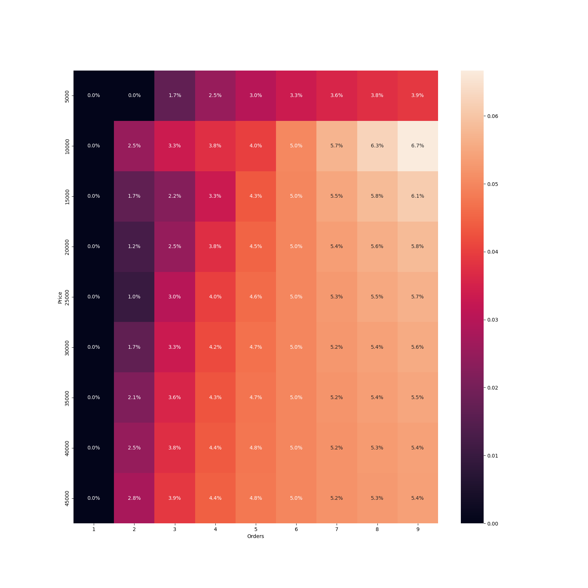
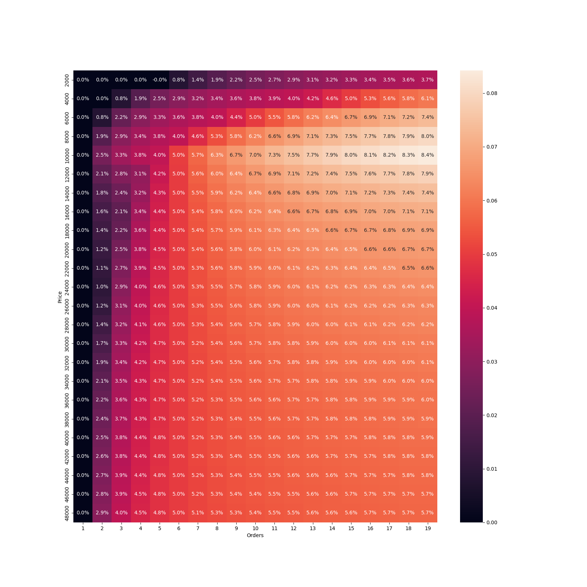
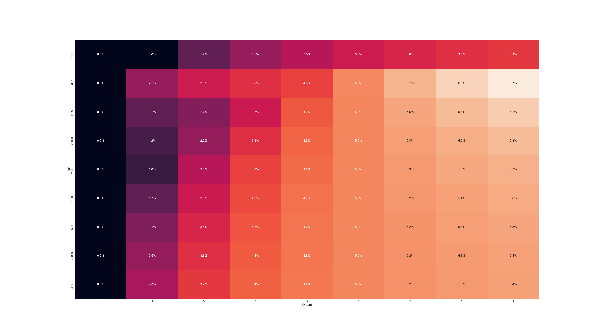

# Fastwork Commission Table

As per Fastwork commision table (checked on 20JAN2023) [Link](https://static.fastwork.co/contents/commission),


## Analysis
Performed on 20JAN2023

The values in the heatmap are the cost saving in percentage relative to total price when compare between a single order vs multiple orders

For example, between a project quoted as 18,000 THB vs 3 projects quoted as 6,000 THB
- A project quoted as 18k THB will be charged for Fastwork commission fee as the following:
  - 0-10k Tier will be charged with 17% : 10,000 * 0.17 = 1,700 THB
  - 10-50k Tier will be charged with 12% : 8000 * 0.12 = 960 THB
  - In total, 2,660 THB
- A project quoted as 6k THB will be charged for Fastwork commission fee as the following:
  - 0-10k Tier will be charged with 17% : 6,000 * 0.17 = 1,020 THB
- 3 project quoted as 6k THB each will be charged for Fastwork commission fee in total of 1,020 x 3 = 3,060 THB
- Therefore by having a single project over multiple project, you can save 3,060 - 2,660 = 400 THB
- Which is 400/18000 = ~2.22% saving of the total price.


### Price from 5,000 to 50,000 THB. Step: 5,000 THB


### Price from 2,000 to 50,000 THB. Step: 2,000 THB


### Price from 1,500 to 50,000 THB. Step: 1,500 THB


### Price from 1,000 to 50,000 THB. Step: 1,000 THB


## Setup

Create virtual environment
```
virtualenv venv
``

Activate virtual environment

```
. .\venv\Scripts\activate
```

Install dependencies
```
pip install -r requirements.txt
```