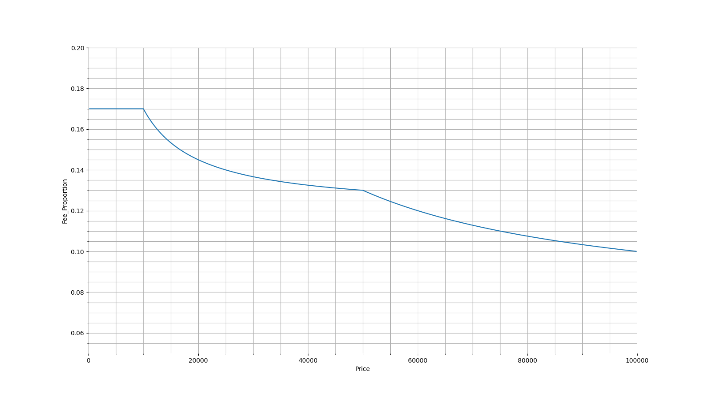
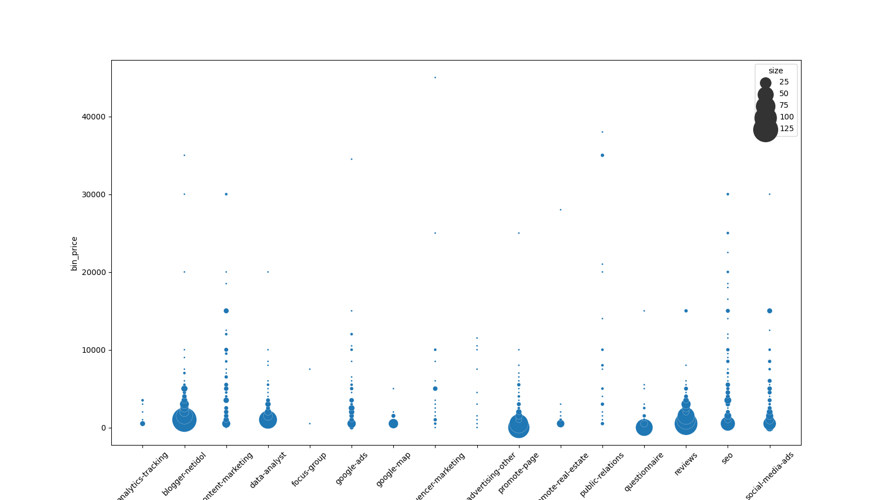
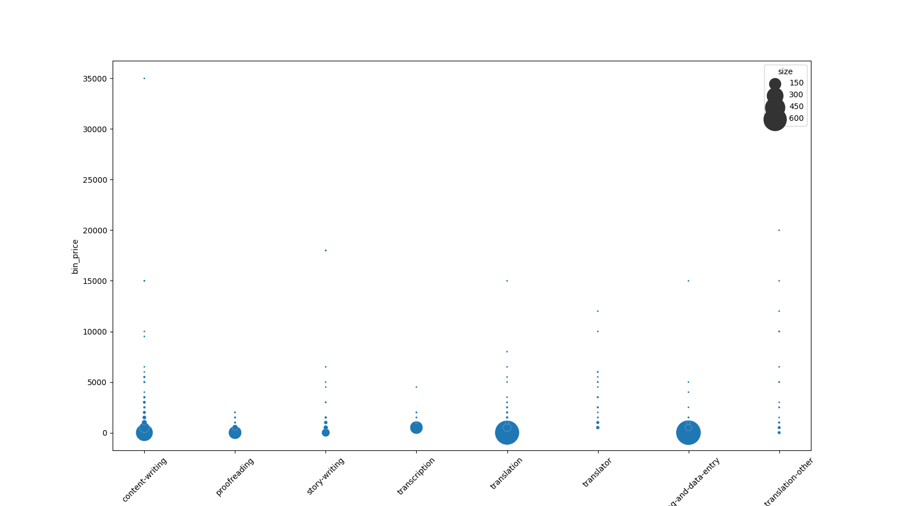
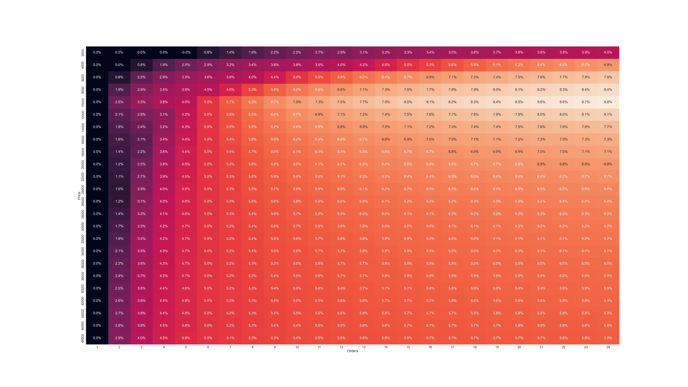
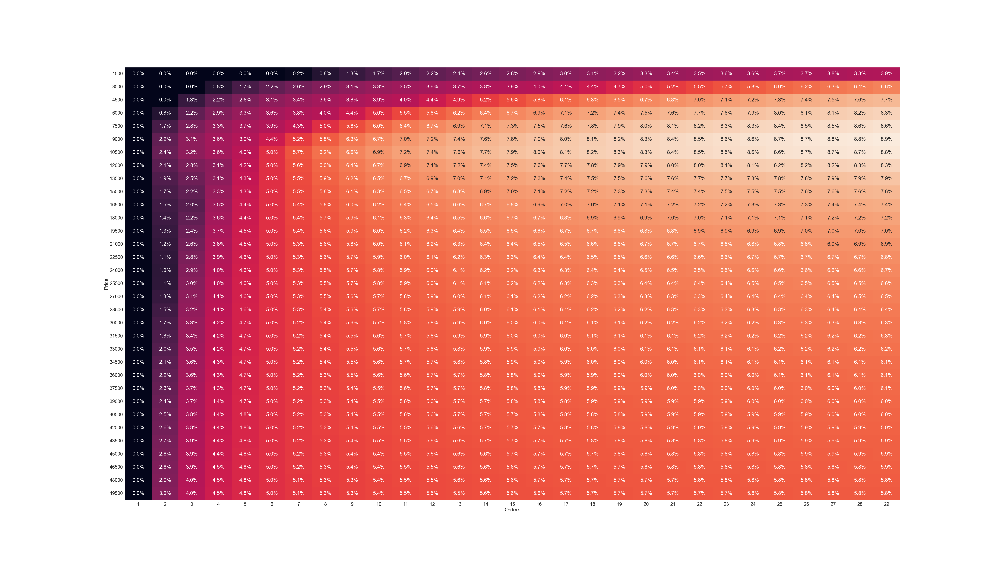

# ตารางวิเคราะห์ค่าบริการของ Fastwork

## จุดประสงค์

จากตารางค่าบริการของ Fastwork [ตามลิงค์](https://static.fastwork.co/contents/commission) หรือตามรูป


|  มูลค่าของงาน | อัตราค่าบริการ |
|:-----------:|:-----------:|
|   0-10000   |     17%     |
| 10000-50000 |     12%     |
|    50000+   |      7%     |

อัพเดทล่าสุด 20JAN2023

ผมสังเกตว่าหากเราเปิดออร์เดอร์ในราคาที่สูงจะยิ่งมีการเสียค่าบริการที่น้อยลง ซึ่ง
จึงได้ลองทำการจำลองว่าระหว่างเปิดออร์เดอร์หนึ่งออร์เดอร์ในราคาสูงกับเปิดออร์เดอร์หลายออร์เดอร์ในราคาต่ำ 
โดยที่ยอดรวมของทั้งสองกรณีเท่ากันแล้ว และหาข้อสรุปว่ามีส่วนต่างกันมากน้อยเพียงใด ระหว่างสองกรณีนี้


## ผลการวิเคราะห์

ดำเนินการเมื่อวันที่ 20JAN2023

### สัดส่วนค่าบริการกับราคาที่ตั้ง


จากกราฟจะเห็นได้ว่า ช่วง 0-10000 บาทแรก สัดส่วนค่าบริการต่อมูลค่าของงานที่ตั้งอยู่ร้อยละ 17 ตามตารางค่าบริการ
ส่วนที่สอง ช่วง 10000-50000 บาท สัดส่วนของค่าบริการจะเป็นในรูปแบบกราฟที่เรียกว่า Exponential decay จนสุดอยู่ที่ 13%
ส่วนที่สาม ช่วง 50000 บาท เป็นต้นไปก็อยู่ในรูปแบบของ Exponential decay เช่นกัน และเมื่อรันไปจนถึงราคา 100,000 จะสุดอยู่ที่ 10%

แล้วจะรันตัวเลขต่อไปเรื่อยๆ สัดส่วนจะไปสุดอยู่ที่ ~7.003% 
นั้นหมายความว่าเราจะเสียค่าบริการได้น้อยที่สุดคือประมาณ 7% ของมูลค่างาน
แต่นั้นก็ต่อเมื่อเราตั้งราคามูลค่างานสูงมากๆเป็นหลักล้านเลย

ซึ่งสำหรับงานฟรีแลนซ์แล้ว คงเป็นไปได้ยากที่มูลค่างานจะสูงขนาดนั้น หากเป็นเพียงแค่บุคคล ไม่ใช่บริษัทรับงานแต่อย่างใด
ดังนั้น ตัวเลขสัดส่วนค่าบริการต่อมูลค่าของงาน ที่พอจะเป็นไปได้สำหรับฟรีแลนซ์บุคคล จะอยู่ในช่วง 10-17% 

### วิเคราะห์ราคาที่ประกาศใน Fastwork

#### ราคาแบ่งตามหมวดหมู่ใหญ่


#### ราคาแบ่งตามหมวดหมู่ย่อยใต้ Design Graphic


#### ราคาแบ่งตามหมวดหมู่ย่อยใต้ Marketing Advertising


#### ราคาแบ่งตามหมวดหมู่ย่อยใต้ Photography Video


#### ราคาแบ่งตามหมวดหมู่ย่อยใต้ Writing Translation


#### ราคาแบ่งตามหมวดหมู่ย่อยใต้ Web Programming


#### ราคาแบ่งตามหมวดหมู่ย่อยใต้ Consultant


#### ราคาแบ่งตามหมวดหมู่ย่อยใต้ Operation


### ส่วนต่างระหว่างเปิดหนึ่งออร์เดอร์ กับ หลายออร์เดอร์

ตัวเลขในตารางจะเป็น อัตราร้อยละของส่วนต่างกับยอดรวมเมื่อเปรียบเทียบระหว่างกรณี หนึ่งออร์เดอร์ กับ หลายออร์เดอร์ ในยอดรวมที่เท่ากัน

ตัวอย่างเช่น ระหว่าง หนึ่งงาน ในราคา 18,000 บาท กับ สามงาน ในราคางานละ 6,000 บาท
- ออร์เดอร์งานราคา 18k บาท จะถูกหักค่าบริการให้กับ Fastwork ในจำนวนเงิน : 2,660 บาท
- ออร์เดอร์งานราคา 6k บาท  จะถูกหักค่าบริการให้กับ Fastwork ในจำนวนเงิน : 1,020 บาท
- หากเป็น ออร์เดอร์งานราคา 6k จำนวนสามงาน จะทำให้ถูกหักค่าบริการรวมถึง : 3,060 บาท
- ส่วนต่างระหว่างการเปิด หนึ่งออร์เดอร์ กับ สามออร์เดอร์ คือ 3,060 - 2,660 = 400 บาท
- เท่ากับว่าการเปิดหนึ่งออร์เดอร์ประหยัดค่าบริการได้ 400 บาท ซึ่งคิดเป็น ~2.22% ของยอดรวม (18,000 บาท)

#### ตารางราคาจาก 5,000 ถึง 50,000 บาท. ขั้นละ 5,000 THB


#### ตารางราคาจาก 2,000 ถึง 50,000 THB. ขั้นละ: 2,000 THB


#### ตารางราคาจาก 1,500 ถึง 50,000 THB. ขั้นละ: 1,500 THB


#### ตารางราคาจาก 1,000 ถึง 50,000 THB. ขั้นละ: 1,000 THB


## ข้อสังเกต

หากวิเคราะห์จากตารางราคาขั้นละ 1000 บาท จะเห็นได้ชัดว่ามีช่วงที่มีการประหยัดค่าบริการได้มากกว่า 7% ในช่วงราคา 10k บาท และมากกว่า 12 ออร์เดอร์ขึ้นไป
หรือตรงบริเวณที่ตัวเลขใช้สีดำแทนสีขาวนั้นเอง

หรือให้เข้าใจอีกแบบคือ
ระหว่างเปิดออร์เดอร์ในราคา 120,000 บาท หนึ่งออร์เดอร์ vs กับออร์เดอร์ละ 10,000 บาท จำนวน 12 ออร์เดอร์
ถ้าคำนวนจริงๆ ค่าบริการของทั้งสองกรณีนี้คือ
- กรณีหนึ่งออร์เดอร์ 120k : 11,400 บาท + ภาษี 3% ทั้งหมดเป็น 15,000 บาท
- กรณี 12 ออร์เดอร์ ออร์เดอร์ละ 10k : (1,700 บาท + ภาษี 3%) x 12 = 24,000 บาท
จะมีส่วนต่างมากถึง 9,000 บาท หรือคิดเป็น 7.5% ของยอดรวม 120k ได้เลย

ดังนั้น จะเป็นการดีกว่าที่จะปรับกลยุทธการตั้งราคาและเปิดออร์เดอร์ให้หนึ่งออร์เดอร์มีราคาสูง เพื่อประหยัดค่าบริการ
แต่ทั้งนี้ ต้องคำนึกถึงความเป็นจริงที่ว่างานที่ราคาสูง มักจะมีขนาดใหญ่และใช้เวลานาน ซึ่งอาจจะทำให้ขาดสภาพคล่องทางการเงินของผู้รับจ้างได้

จากตัวอย่างที่แล้ว ที่ยอดรวม 120k ลองมาเปลี่ยนเป็น ออร์เดอร์ละ 20k, 30k, 40k
- แบ่งเป็น 3 งาน งานละ 40k มีส่วนต่างที่ 3.8% => 4,560 บาท
- แบ่งเป็น 4 งาน งานละ 30k มีส่วนต่างที่ 4.2% => 5,040 บาท
- แบ่งเป็น 6 งาน งานละ 20k มีส่วนต่างที่ 5.0% => 6,000 บาท

หากมองว่าเป็นค่าใช้จ่ายเพื่อแลกกับสภาพคล่องทางการเงิน และการได้รีวิวงานเพิ่มขึ้นแล้ว ก็อาจจะคุ้มสำหรับผู้รับจ้างหลายๆคนก็ได้

แต่ว่าหากดำเนินการแบ่งชำระเงินตามขั้นตอน
- สำหรับฟรีแลนซ์ [Link](https://www.slimfaq.com/fastwork-co-bfa21e87-1550-4d30-9cb2-a8eec7a0969e/1818-/27561-)
- สำหรับผู้ว่าจ้าง [Link](https://www.slimfaq.com/fastwork-co-bfa21e87-1550-4d30-9cb2-a8eec7a0969e/1818-/27569-)

น่าจะช่วยลดปัญหาเรื่องสภาพคล่องทางการเงินได้ดีขึ้น ในขณะที่ไม่เสียค่าบริการมากเท่ากับการแบ่งงานเป็นหลายๆออร์เดอร์

## Setup

Create virtual environment
```
virtualenv venv
```

Activate virtual environment

```
. .\venv\Scripts\activate
```

Install dependencies
```
pip install -r requirements.txt
```