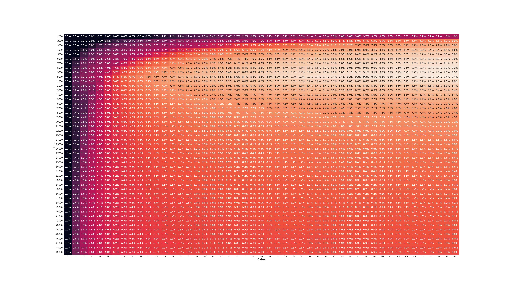

# ตารางวิเคราะห์ค่าธรรมเนียมของ Fastwork

## จุดประสงค์

จากตารางค่าธรรมเนียมของ Fastwork [ตามลิงค์](https://static.fastwork.co/contents/commission) หรือตามรูป


อัพเดทล่าสุด 20JAN2023

ผมตั้งข้อสังเกตว่าหากเราเปิดออร์เดอร์ในราคาที่สูงจะยิ่งมีการเสียค่าธรรมเนียมที่น้อยลง ซึ่ง
จึงได้ลองทำการจำลองว่าระหว่างเปิดออร์เดอร์หนึ่งออร์เดอร์ในราคาสูงกับเปิดออร์เดอร์หลายออร์เดอร์ในราคาต่ำ 
โดยที่ยอดรวมของทั้งสองกรณีเท่ากันแล้ว และหาข้อสรุปว่ามีส่วนต่างกันมากน้อยเพียงใด ระหว่างสองกรณีนี้


## ผลการวิเคราะห์

ดำเนินการเมื่อวันที่ 20JAN2023

ตัวเลขในตารางจะเป็น อัตราร้อยละของส่วนต่างกับยอดรวมเมื่อเปรียบเทียบระหว่างกรณี หนึ่งออร์เดอร์ กับ หลายออร์เดอร์ ในยอดรวมที่เท่ากัน

ตัวอย่างเช่น ระหว่าง หนึ่งงาน ในราคา 18,000 บาท กับ สามงาน ในราคางานละ 6,000 บาท
- ออร์เดอร์งานราคา 18k บาท จะถูกหักค่าธรรมเนียมให้กับ Fastwork ในจำนวนเงิน : 2,660 บาท
- ออร์เดอร์งานราคา 6k บาท  จะถูกหักค่าธรรมเนียมให้กับ Fastwork ในจำนวนเงิน : 1,020 บาท
- หากเป็น ออร์เดอร์งานราคา 6k จำนวนสามงาน จะทำให้ถูกหักค่าธรรมเนียมรวมถึง : 3,060 บาท
- ส่วนต่างระหว่างการเปิด หนึ่งออร์เดอร์ กับ สามออร์เดอร์ คือ 3,060 - 2,660 = 400 บาท
- เท่ากับว่าการเปิดหนึ่งออร์เดอร์ประหยัดค่าธรรมเนียมได้ 400 บาท ซึ่งคิดเป็น ~2.22% ของยอดรวม (18,000 บาท)


### ตารางราคาจาก 5,000 ถึง 50,000 บาท. ขั้นละ 5,000 THB


### ตารางราคาจาก 2,000 ถึง 50,000 THB. ขั้นละ: 2,000 THB


### ตารางราคาจาก 1,500 ถึง 50,000 THB. ขั้นละ: 1,500 THB


### ตารางราคาจาก 1,000 ถึง 50,000 THB. ขั้นละ: 1,000 THB



## Setup

Create virtual environment
```
virtualenv venv
``

Activate virtual environment

```
. .\venv\Scripts\activate
```

Install dependencies
```
pip install -r requirements.txt
```